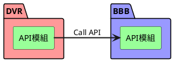

```plantuml
@startuml
skinparam actorStyle awesome
left to right direction

' 元件圖形
'actor 使用者
' 長方形
'rectangle rectangle
'frame frame
'folder folder
'file file
'agent agent
'artifact artifact
'card card
'component component
' 外部圓形
'storage storage
'usecase usecase
' 小圓形
'interface  interface
'control control
'boundary boundary
'entity entity

'cloud cloud

'database database
'queue queue

'node node
'package package
'stack stack

package "DVR" #F99 {
	rectangle API模組 as D_API #9F9
}

package "BBB" #99F {
	rectangle API模組 as D_BBB #9F9
}

D_API ==> D_BBB : Call API

@enduml
```
