# 如何快速找到理想中的股票
點進來 [選股神器](https://gavinh0731.github.io/stock_picker)
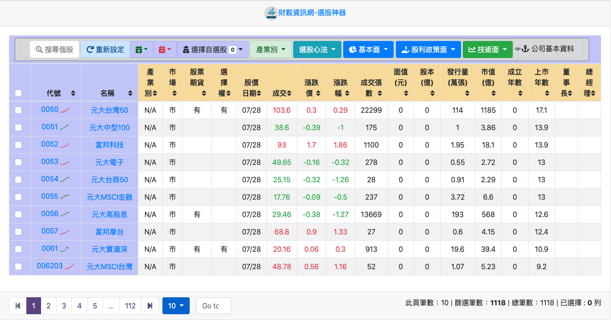

## 快速搜尋個股
按上面工具列中的`搜尋個股`，可以在左邊輸入`你關注的股票例如：台積電`
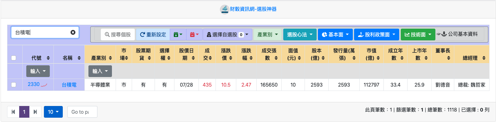

## 快速篩選產業別
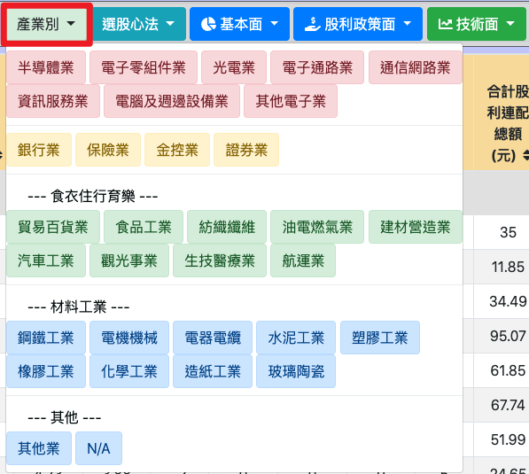

## 透過選股心法，快速找出績優股

1. 基本面—股魚選股心法（類似巴菲特選股法）
   
   `ROE>8%, 本業收入率>80%, 負債率<60%, 營業利益率>0, 營運現金流量>0`
   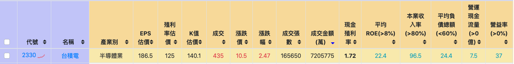
   
2. 基本面—近四季財報成長
   
   財報評分>70, 成長欄位數>7
   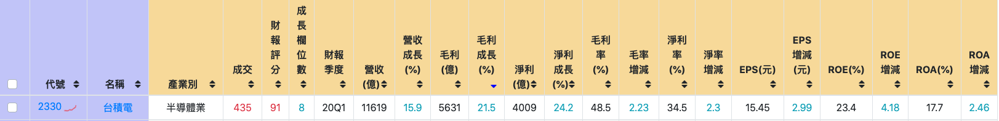

3. 技術分析-阿水一式
   
   壓縮：股價壓縮至少10個交易日, 

   帶量：成交量出現過去5日均量的2～10倍, 

   突破：當日收盤價突破通道頂且收紅K棒
   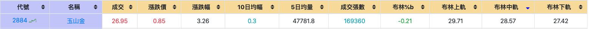

4. 黃金交叉|死亡交叉—KD指標
   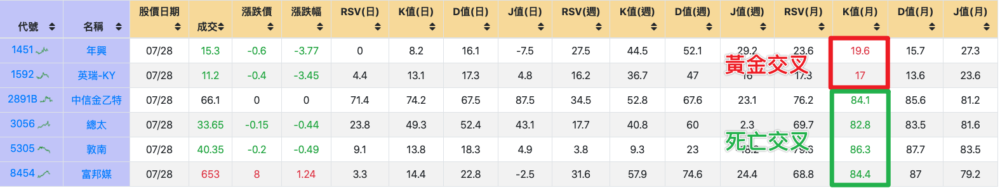
<!-- more -->

# 連結到其他股市網站

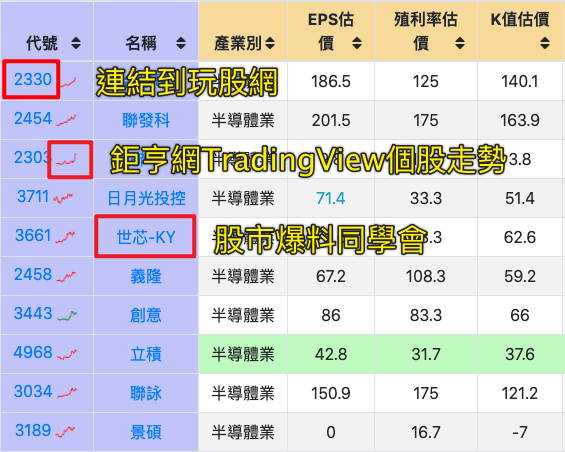

1. 玩股網：有技術分析、法人動態、資券變化等
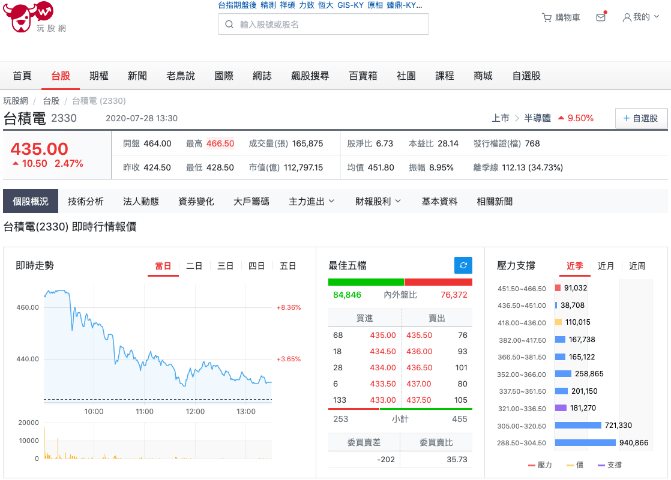

2. 鉅亨網TradingView個股走勢

3. 股市爆料同學會
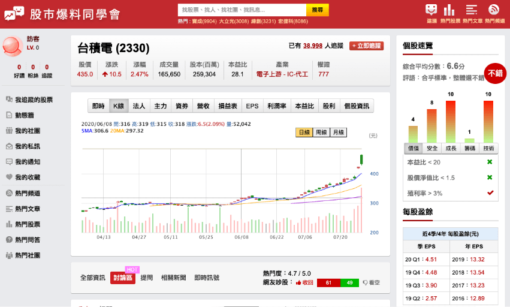

# `快捷鍵`快速切換面面觀
  可以透過滑鼠直接選擇與關注的面向
  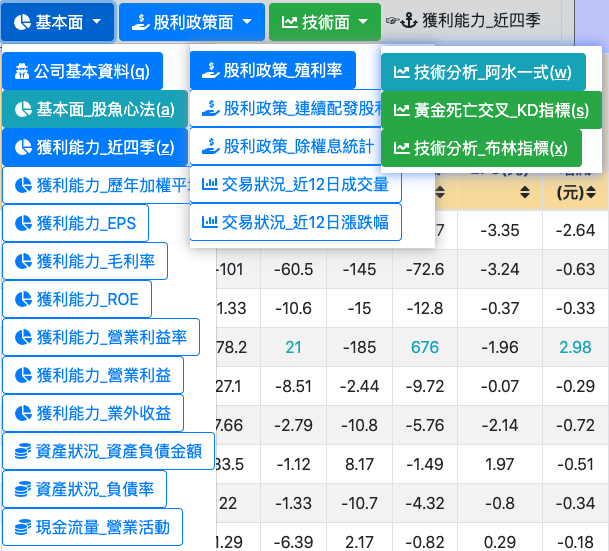

  也可以透過`快捷鍵`快速切換：
  + `Q`: 公司基本資料
  + `A`: 基本面—股魚心法
  + `Z`: 獲利能力—近四季
  + `W`: 技術分析—阿水一式
  + `S`: 黃金死亡交叉—KD指標
  + `X`: 技術分析—布林指標
  + `空白鍵`: 下一頁
  + `O`: 上一頁
  + `P`: 下一頁
  當搜尋個股功能開啟時，快捷鍵功能將會暫時失效

# 免入會員加入`自選股`到雲端

## 自選股設定
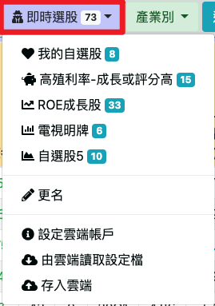

## 加入自選股
如圖所示：
1. 選擇欲加入的股票
2. 點選加入按鈕
3. 選擇類別
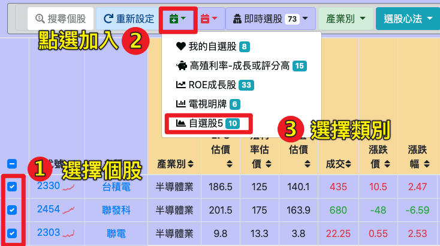

## 同步到雲端
1. 設定雲端帳戶
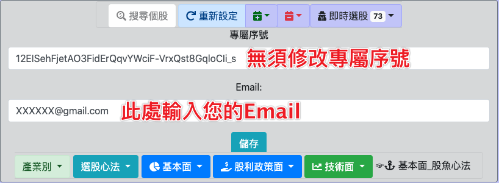
2. 由雲端讀取設定檔（得到雲端的自選股設定）
3. 存入雲端（將您設定的自選股存入雲端）
