## K線重點整理

以下介紹 蠟燭圖表的使用和重要性：

### 蠟燭圖表的起源和結構

+ 蠟燭圖表起源於日本，用於分析大米市場。每根蠟燭代表一個交易週期，通常為一天。每根蠟燭包含四個價格資訊：`開盤價`、`收盤價`、`最高價` 和 `最低價​​`。

### 蠟燭圖的組成部分

+ 蠟燭圖由 `蠟燭本體` 和 `上下影線` 組成。蠟燭本體表示開盤價和收盤價之間的區域，影線則表示最高價和最低價​。
    
### 蠟燭圖的顏色

+ 蠟燭圖的顏色用於區分價格的變動。通常，實體部分為 **紅色** 代表收盤價高於開盤價（價格上漲），而 **黑色或綠色** 代表收盤價低於開盤價（價格下跌）。
    
### 常見的蠟燭形態

文章介紹了一些常見的蠟燭形態及其含義，包括：

+ **鎚子線（Hammer）**：出現在下降趨勢中，預示著可能的反轉。
+ **倒鎚子線（Inverted Hammer）**：出現在下降趨勢中，也預示著可能的反轉。
+ **射擊之星（Shooting Star）**：出現在上升趨勢中，預示著可能的反轉。
+ **十字線（Doji）**：開盤價和收盤價相同，表示市場猶豫不決​。

### 使用蠟燭圖表的優勢

蠟燭圖表能夠清晰地顯示市場的價格變動，並提供直觀的圖像，有助於投資者做出更明智的決策。通過觀察蠟燭圖，投資者可以識別市場趨勢，找到買入或賣出的時機​。

### 結合其他技術分析工具

文章建議，蠟燭圖表應與其他技術分析工具結合使用，如移動平均線、相對強弱指數（RSI）等，以提高預測的準確性​。

---

以下為轉載內容：更多詳情請參閱[完整文章](https://enjoyfreedomlife.com/candlestick-chart/)。
## 股票K線怎麼看？如何判斷？新手入門必學的12種基礎形態
---

最後更新日期： 2023-04-26

技術分析是大多數人進入股票市場最先接觸到的一項分析工具，根據過去股價的走勢，推斷未來的趨勢方向，進一步找出進、出場位置，以圖表和線圖的方式表現，就像是股市中的GPS。

而要學會技術分析，首先，必須先從股票K線圖開始學起，K線圖是將每天、每週、每月的股價漲跌變化的表現，以圖形的方式呈現，透過K線圖可以透露出買賣雙方力道的強弱以及趨勢發展的方向。

本篇我將和你分享，什麼是K線？K線怎麼看？紅K線與黑K線如何判斷？K線種類有哪些？如何利用K線判斷多空力道強弱？以及常見的12種K線型態。

目錄

-   [什麼是K線？](https://enjoyfreedomlife.com/candlestick-chart/#%E4%BB%80%E9%BA%BC%E6%98%AFK%E7%B7%9A%EF%BC%9F "什麼是K線？")
-   [K線怎麼看？](https://enjoyfreedomlife.com/candlestick-chart/#K%E7%B7%9A%E6%80%8E%E9%BA%BC%E7%9C%8B%EF%BC%9F "K線怎麼看？")
-   [紅K線與黑K線如何判斷？](https://enjoyfreedomlife.com/candlestick-chart/#%E7%B4%85K%E7%B7%9A%E8%88%87%E9%BB%91K%E7%B7%9A%E5%A6%82%E4%BD%95%E5%88%A4%E6%96%B7%EF%BC%9F "紅K線與黑K線如何判斷？")
-   [K線種類](https://enjoyfreedomlife.com/candlestick-chart/#K%E7%B7%9A%E7%A8%AE%E9%A1%9E "K線種類")
-   [K線判斷多空力道強弱](https://enjoyfreedomlife.com/candlestick-chart/#K%E7%B7%9A%E5%88%A4%E6%96%B7%E5%A4%9A%E7%A9%BA%E5%8A%9B%E9%81%93%E5%BC%B7%E5%BC%B1 "K線判斷多空力道強弱")
-   [股價反映一切消息](https://enjoyfreedomlife.com/candlestick-chart/#%E8%82%A1%E5%83%B9%E5%8F%8D%E6%98%A0%E4%B8%80%E5%88%87%E6%B6%88%E6%81%AF "股價反映一切消息")
-   [常見的12種基礎K線型態](https://enjoyfreedomlife.com/candlestick-chart/#%E5%B8%B8%E8%A6%8B%E7%9A%8412%E7%A8%AE%E5%9F%BA%E7%A4%8EK%E7%B7%9A%E5%9E%8B%E6%85%8B "常見的12種基礎K線型態")
-   [結論](https://enjoyfreedomlife.com/candlestick-chart/#%E7%B5%90%E8%AB%96 "結論")

**K線（Candlestick chart）** 又稱為「**蠟燭線**」、「**陰陽線**」，起源於日本德川幕府時代米市交易，當時是用來計算米價每天的行情與價格波動，包括開市價、收市價、最高價及最低價。

後來這個計算的概念被引進來股票市場，用來反應價格變化的圖線，透過K線圖，能將每分、每日、每週甚至每月的價格走勢記錄下來。

每一根K線的產生，都是由真金白銀所堆砌出來的結果，市場上的所有消息，不管是好消息還是壞消息，都會反映在K線圖上。

K線圖上會顯示出市場的趨勢方向與力道強弱、買家與賣家之間的角力關係、對於消息出現後的反應變化以及投資人的心理狀態，因此利用觀察K線的走勢與型態，高手一眼就能從中找到獲利的機會。

## K線怎麼看？

K線主要是由4個價格所組成：**開盤價**、**收盤價**、**最高價**、**最低價**，台股在9點開市後一直到下午1點半結束，過程中K棒會不斷隨著價格漲跌而有變化，直到收盤時才停止。

-   **開盤價**：股市開市後第一筆買賣所成交的價格（台股9：00開市）
-   **收盤價**：股市閉市前第後一筆買賣所成交的價格（台股13：30閉市）
-   **最高價**：當日股價最高的價格
-   **最低價**：當日股價最低的價格

這4個價格的組合就會形成K棒，而K棒本身又可以分成兩個部分：「**實體**（蠟燭本身）」與「**影線**（兩端燭芯）」。

-   **實體**（蠟燭）：是由「**開盤價**」和「**收盤價**」所構成。
-   **影線**（燭芯）：分為「**上影線**」和「**下影線**」，是由「**最高價**」和「**最低價**」所構成。

## **紅K線與黑K線如何判斷？**

理解K線是如何組成之後，接下來進一步學習如何用K線來判斷漲跌。

K線分為兩種顏色，分別為**紅色**（陽線）及**黑色**（陰線；或**綠色**），而決定是哪種顏色呈現的關鍵在於「**開盤價**」與「**收盤價**」之間的關係。

#### **紅K線（陽線）：**

當「**收盤價**」>「**開盤價**」時，代表股價上漲，以紅K表示。

舉例來說，今天有一檔股票開盤價為30元，盤中最高上漲至33元，最低下跌至29元，最後收盤價為32元，表示今日股價雖然盤中有下跌，但最終收盤價價比開盤價高呈現上漲，以日K來看就會以紅K表示。

而因為在盤中股價曾一度到達29及33元，因此就會在K線上出現「**上影線**」及「**下影線**」。

#### **黑K線（陰線）：**

當「**開盤價**」>「**收盤價**」時，代表股價下跌，以黑K或綠K表示。

舉例來說，今天有一檔股票開盤價為40元，盤中最高上漲至42元，最低下跌至37元，最後收盤價為38元，表示今日股價呈現下跌，以日K來看就會以黑K表示。

## **K線種類**

K線會依據不同單位時間區分，各種不同週期的K線圖運用的功能有所不同，一般使用技術分析作為進出場判斷的話，會以分K或日K做尋找進出場點，而周K、月K判斷整體多空趨勢。

基本上，常見的K線種類有以下幾種：

-   1分K：1分鐘的價格變化所形成的K線。
-   5分K：5分鐘的價格變化所形成的K線。
-   15分K：15分鐘的價格變化所形成的K線。
-   30分K：30分鐘的價格變化所形成的K線。
-   60分K：60分鐘的價格變化所形成的K線。
-   日K線：一天的價格變化所形成的K線（台股：9：00~13：30）。
-   周K線：一週的價格變化所形成的K線（每週第1個交易日開盤價至當周最後一個交易日的收盤價）。
-   月K線：一個月的價格變化所形成的K線（每月第1個交易日開盤價至當月最後一個交易日的收盤價）。
-   年K線：一年的價格變化所形成的K線（每年第1個交易日開盤價至當年最後一個交易日的收盤價）。

舉例來說，1根周K是由過去一週內5個交易日的K棒所集合而成的（如果當周只有4個交易日，那麼周K就是由這4根日K所組成）。

所以只要知道星期一早上9:00的「**開盤價**」和星期五下午1：30的「**收盤價**」，以及這5個交易日出現的「**最高點**」和「**最低點**」，就能夠將5日的K線及合成一根周K線。

同理，1根月K線的出現，也是集結當月每個交易日股價走勢變化而得的結果，當月第一個交易日早上9:00的「**開盤價**」和當月最後一個交易日下午1：30的「**收盤價**」，以及當月出現的「**最高點**」和「**最低點**」，就能形成1根月K線。

## **K線判斷多空力道強弱**

透過K線的長相，藉由觀察K線的「**實體**」能夠初步判斷當天的股價多空力道的強弱，如果實體的長度越長，代表當天的力道越強，若能進一步搭配「**成交量**」來一起判斷會更準確。

當「**開盤價**」與「**收盤價**」距離越遠，兩者的價格差距越大，實體的長度就會越長，若兩者之間差距達5%以上，就可以稱為是長紅K或長黑K。

如果出現「**開盤價**」等於「**收盤價**」的狀況時，K線會以「**＋**」表示，代表當天買方與賣方的力道分不出高下，呈現平衡狀態。

## **股價反映一切消息**

所有的好消息、壞消息、利多消息、利空消息，都會呈現在K線圖上，因此從K線上就能初步判斷消息是否屬實。

舉例來說，週末出現某支股票利多消息，照理說週一股價應該上漲反映這項利多，但事實上週一股價卻呈現下跌，形成「**利多不漲**」。

**這是多數投資人最常陷入的盲點。**

從股價的位階可以來判斷，這項利多消息是否已經提前反應在股價上面了，也就是說，過去一段時間股價上漲投資人卻不知道在漲什麼？

直到這項消息出現，市場上投資人終於明白股價上漲的原因，但是週一股價卻沒有受到利多消息激勵上漲，反而呈現下跌，因此可以推斷股價早已反應完這項利多，出現「**利多出盡**」的現象。

此時多數投資人最常犯的錯就是，由於週末看到利多消息，週一急忙趕著進場，怕沒有在第一時間上車使獲利減少，而容易因此被套在相對高點的位置。

所以如果下次看到股票的任何消息，都可以透過股價的反應來判斷是否值得進場投資或是該減碼出場，如果能搭配「**成交量**」來一起判斷，判斷的準確率會更高。

## **常見的12種基礎K線型態**

-   **大陽線（長紅K）**
-   **開盤價=最低價，收盤價=最高價**
-   **買盤力道強勁，強烈看漲**

-   **紅K上影線**
-   **開盤價=最低價，留上影線**
-   **股價強力上漲，但遇到賣方壓力使股價拉回，上影線越長，表示賣壓越大。**

-   **紅K下影線**
-   **收盤價=最高價，留下影線**
-   **開盤小跌後，買盤力道加大，漲勢強勁。**

-   **紅K上下影線**
-   **股價下跌出現買盤，上漲後出現賣壓，多空交戰，多方仍佔有優勢。**

-   **大陰線（長黑K）**
-   **開盤價=最高價，收盤價=最低價**
-   **空方力道強勁，強烈看跌**

-   **黑K上影線**
-   **收盤價=最低價，留上影線**
-   **上漲買盤力道不足，股價續跌，賣壓力道仍強勁。**

-   **黑K下影線**
-   **開盤價=最高價，留下影線**
-   **股價下跌後出現買盤，賣方力道稍微削減。**

-   **黑K上下影線**
-   **股價上漲出現賣壓，下跌後出現買盤，多空交戰，空方仍佔有優勢。**

-   **十字線**
-   **開盤價=收盤價，留上下影線**
-   **股價上漲遇到賣壓，下跌出現買盤，多空交戰勢均力敵，常出現在行情轉折的位置。**

-   **一字線**
-   **開盤價=收盤價=最高價=最低價**
-   **股價當天只有1種價格，多方或空方非常強勢，如果是跳空上漲出現一字線，代表開盤即漲停板；如果是跳空下跌出現一字線，代表開盤即跌停板。**

-   **T字線**
-   **開盤價=收盤價=最高價，留下影線**
-   **開盤後出現賣壓，使股價下跌一段後，出現較強的買盤力道，股價開始反彈，一路拉回至開盤價的位置。**

-   **倒T字線**
-   **開盤價=收盤價=最低價，留上影線**
-   **開盤後股價出現買盤使股價上漲一段後，賣壓湧現且力道較強，使股價回跌至開盤的位置。**

## **結論**

技術分析的技術範疇很廣泛且方法種類很多，而最基礎的是必須要擁有K線判斷的能力，從K線的走勢變化及形態能夠透漏出多空買賣力道強度，進一步搭配成交量、其他分析指標及籌碼分析，能夠協助投資人提升判斷的準確率，也可以作為買賣進出場的依據。
