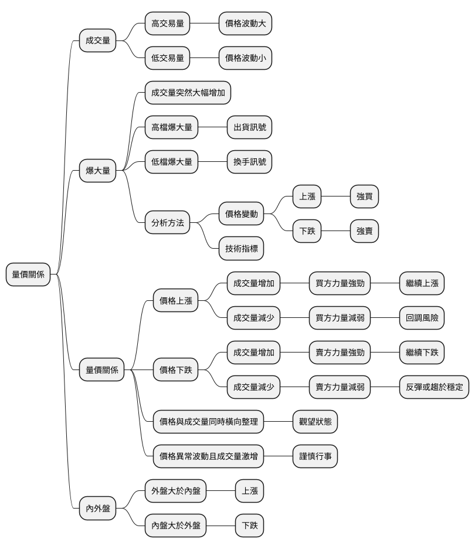

```plantuml
@startmindmap
* 量價關係

++ 成交量
+++ 高交易量
++++ 價格波動大
+++ 低交易量
++++ 價格波動小

++ 爆大量
+++ 成交量突然大幅增加
+++ 高檔爆大量
++++ 出貨訊號
+++ 低檔爆大量
++++ 換手訊號
+++ 分析方法
++++ 價格變動
+++++ 上漲
++++++ 強買
+++++ 下跌
++++++ 強賣
++++ 技術指標

++ 量價關係

+++ 價格上漲
++++ 成交量增加
+++++ 買方力量強勁
++++++ 繼續上漲
++++ 成交量減少
+++++ 買方力量減弱
++++++ 回調風險

+++ 價格下跌
++++ 成交量增加
+++++ 賣方力量強勁
++++++ 繼續下跌
++++ 成交量減少
+++++ 賣方力量減弱
++++++ 反彈或趨於穩定

+++ 價格與成交量同時橫向整理
++++ 觀望狀態
+++ 價格異常波動且成交量激增
++++ 謹慎行事

++ 內外盤
+++ 外盤大於內盤
++++ 上漲
+++ 內盤大於外盤
++++ 下跌
@endmindmap
```
